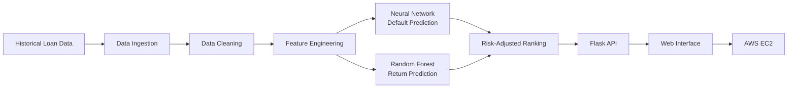

# PeerVest-Data-Pipeline
End-to-end data pipeline and machine learning recommendation system for P2P lending risk and return analysis.

## Project Overview

The project processes historical LendingClub loan data and builds an end-to-end workflow from raw CSV ingestion to model-based loan recommendation.

## Pipeline Architecture

Raw LendingClub CSV Data  
→ Data Cleaning & Missing Value Handling  
→ Feature Engineering & One-Hot Encoding  
→ Default Risk Prediction Model  
→ Annualized Return Prediction Model  
→ Risk-Adjusted Ranking  
→ Flask Web Application Deployment

## Architecture

## Tech Stack

- Python
- Pandas
- Scikit-learn
- Keras
- SQL concepts
- Flask
- AWS EC2
- HTML/CSS

## Key Features

- Processed 1.7M+ historical loan records
- Built data cleaning and transformation workflow
- Applied feature engineering and one-hot encoding
- Developed Neural Network model for default prediction
- Developed Random Forest model for annualized return prediction
- Created risk-adjusted recommendation logic
- Deployed the solution as a Flask web application on AWS EC2

## Project Report

The full technical report is available in the `report/` folder.
